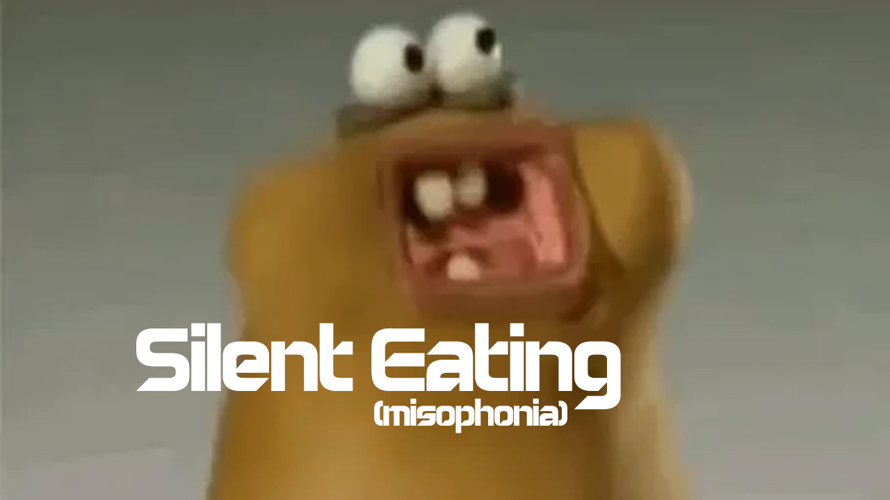

<!-- PROJECT HEADER -->
 

  

  <h2 align="center">Silent Eating - Misophonia mod for Space Engineers</h2>

  

    <a href="https://github.com/vectorcmdr/Silent-Eating-Misophonia-SE/issues">Report A Bug 💥</a>
    ·
    <a href="https://github.com/vectorcmdr/Silent-Eating-Misophonia-SE/issues">Request A Feature 🚀</a>
  

[![Contributors][contributors-shield]][contributors-url] [![Stargazers][stars-shield]][stars-url] [![Issues][issues-shield]][issues-url] 

[contributors-shield]: https://img.shields.io/github/contributors/vectorcmdr/Silent-Eating-Misophonia-SE.svg?style=for-the-badge
[contributors-url]: https://github.com/vectorcmdr/Silent-Eating-Misophonia-SE/graphs/contributors
[stars-shield]: https://img.shields.io/github/stars/vectorcmdr/Silent-Eating-Misophonia-SE.svg?style=for-the-badge
[stars-url]: https://github.com/vectorcmdr/Silent-Eating-Misophonia-SE/stargazers
[issues-shield]: https://img.shields.io/github/issues/vectorcmdr/Silent-Eating-Misophonia-SE.svg?style=for-the-badge
[issues-url]: https://github.com/vectorcmdr/Silent-Eating-Misophonia-SE/issues
<!--
[license-shield]: https://img.shields.io/github/license/vectorcmdr/Silent-Eating-Misophonia-SE.svg?style=for-the-badge
[license-url]: https://github.com/vectorcmdr/Silent-Eating-Misophonia-SE/blob/master/LICENSE.txt
-->

# [Grab it from the Steam Workshop!](https://steamcommunity.com/sharedfiles/filedetails/?id=3592406509)

<!-- ABOUT -->
## About Silent Eating - Misophonia Mod

Maybe you suffer from misophonia... or maybe hearing wet chewing sounds just reminds you of your horrible old colleague who used to loudly chew and slurp their lunchtime burger 🤢.

Either way, the Silent Eating mod is for you!

It replaces the arcade chewing/gulping/stomach sounds:

* Eat01/02/03 with a subtle packet crinkle sound.
* Drink01 with a subtle bottle cap sound.
* FoodPoisoning1/2/3 with a low pitch negative chime sound.

Reach out if there are any issues, or if there are other sounds from this category that you'd like to consider being added.

May your chewing be ever silent 🍔.

(<a href="#readme-top">back to top</a>)

## Installation

_For local play, subscribe to the mod on the [Steam Workshop page.](https://steamcommunity.com/sharedfiles/filedetails/?id=3592406509)._

_For server play, add the ID (3592406509) to your server config._

(<a href="#readme-top">back to top</a>)

<!-- BUILT WITH -->
## Built With

(<a href="#readme-top">back to top</a>)

<!-- BUY ME A COFFEE -->
## Help Support More Like This

(<a href="#readme-top">back to top</a>)

<!-- CONTRIBUTING -->
## Contributing

If you have a suggestion that would make this better, please fork the repo and create a pull request. You can also simply open an issue with the tag "enhancement".
Don't forget to give the project a star! Thanks again!

1. Fork the Project
2. Create your Feature Branch (`git checkout -b feature/AmazingFeature`)
3. Commit your Changes (`git commit -m 'Add some AmazingFeature'`)
4. Push to the Branch (`git push origin feature/AmazingFeature`)
5. Open a Pull Request

(<a href="#readme-top">back to top</a>)

<!-- LICENSE -->
## License

Distributed under the Creative Commons Attribution-NonCommercial-ShareAlike License. See `LICENSE.txt` for more information.

(<a href="#readme-top">back to top</a>)

<!-- CONTACT -->
## Contact

 [ Reddit: @vector_cmdr](https://twitter.com/vector)

 [ GitHub: @vectorcmdr](https://github.com/vectorcmdr)

 [ GitHub Project: Silent-Eating-Misophonia-SE](https://github.com/vectorcmdr/Silent-Eating-Misophonia-SE)

 [ Website: @vector_cmdr](https://vectorcmdr.xyz)

 [ X/Twitter: @vector_cmdr](https://twitter.com/vector)

(<a href="#readme-top">back to top</a>)

